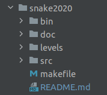

# Install the MLV library
The MLV library is a simplified multimedia library. This library has been designed for beginner students in C, and it allows to add graphical and audio effects on the student program. The library is useful to:

* draw figures, display text and dialog boxes,
* display images,
* play sounds and musics,
* catch mouse and keyboard events,
* get information from dialog boxes.

These tools are simplified interfaces of the SDL library. If you are not a C beginner, better use the SDL library (SDL, SDL_gfx, SDL_sound, SDL_ttf).

    The installation described for Linux machines via the 64 bit packages for Ubuntu has been tested on a live Ubuntu LTS 20.04 distribution booted from a USB key. 
    You just have to install (open with package manager, then click on install) the two packages libumlv (to be able to run programs) and libumlv-dev (to be able to compile your programs)
    as well as the meta package build-essential (type sudo apt install build-essential in a terminal) to have among others gcc.

    Procedure tested and validated on a VM with the latest ubuntu LTS "minimal installation" :
        sudo apt-get install aptitude
        sudo aptitude update
        sudo aptitude full-upgrade
        sudo aptitude install build-essential
        sudo aptitude install libxml2-dev libsdl-image1.2-dev libglib2.0-dev libsdl-ttf2.0-dev libsdl-mixer1.2-dev libsdl1.2-dev libsdl-gfx1.2-dev
        get the two packages libmlv and libmlv-dev from the installation page
        sudo dpkg -i libmlv0_2.0.2-1_amd64.deb libmlv0-dev_2.0.2-1_amd64.deb

    Also download the archive containing the source code of the library and unpack it in your working directory.

    Unpack the archive with the command tar xzf mlv-2.0.2.tar.gz. Go to the mlv-2.0.2/examples/beginner/ directory

    Try a gcc 01_hello_world.c. Does it work? What error do you get?

    Try gcc -c 01_hello_world.c. Normally you should get a file 01_hello_world.o. So it is the link editing and not the compilation that is the problem.
    
    Try gcc 01_hello_world.o -lMLV. This should work and you should get an executable file a.out. Test it, it should display a graphical window with the text hello world. Be careful the option to add is -lMLV and not -IMLV. Moreover this option must be at the end of the command line.

# Content of the archive 



The archive consists of a **Makefile** which will be used to compile the program, the **README.md** which you are reading and
4 directories :
* **BIN :** Contains the .o and the executable ***snake*** after compilation with the Makefile
* **DOC :** Contains the ***user.pdf*** and ***dev.pdf*** documents
* **LEVELS :** Contains the different playable levels of the game : ***01_grid.txt*** / ***02_grid.txt*** / ***default_grid.txt***
* **SRC :** Contains the source files of the program : ***game.c*** / ***grid.c*** / ***snake.c*** / ***grid.h*** / ***snake.h***

# The compilation procedure

The Makefile is a set of command :

* **'make snake' :** which allows to get an executable to play the game
* **'make clean' :** which deletes all temporary compilation files (.o) but not the executable
* **'make clear' :** which deletes all files in the bin/ directory
* **'make tgz' :** which generates the archive in tgz format that you must return

You have to be in your linux terminal and in the snake2020 repository and enter the command to get the executable of the game :
```bash
make snake clean
```

# Program launch

To launch the game with the default level you have to be in your snake repository and enter the following command :
```bash
./bin/snake
```
if you want to change the levels you have to enter the following command : 
```bash
./bin/snake --input levels/<name of your levels>
```
and there is 2 levels in the game : ***01_grid.txt*** and ***02_grid.txt***